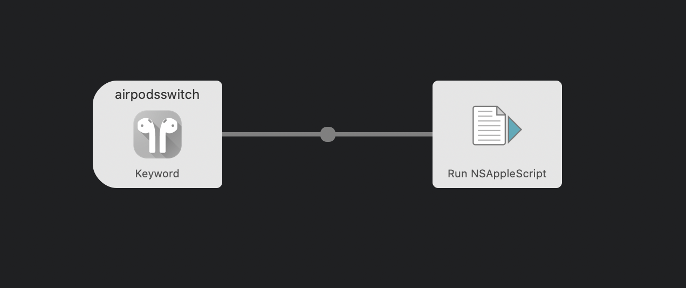
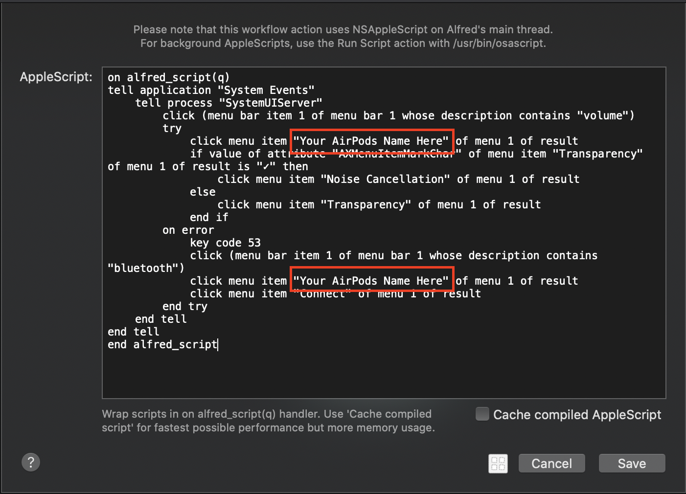
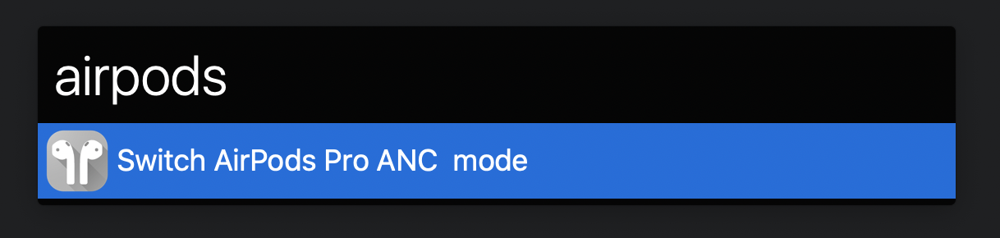

# Alfred AirPods-Pro Controller

This workflow helps you control your AirPods Pro using Alfred.

# Features

* Switch **Transparency** and **Noise Cancellation** mode.
* Automatic connect if your AirPods not connected.

# Install

1. Add this workflow to Alfred.
1. Open `Alfred Settings->Workflows->AirPods Controller` and double click `Run NSAppleScript`.

1. Change `Your AirPods Name Here` to your AirPods name.

For Chinese users, please download `AirPods Pro Controller(CHS)`.

For Big Sur users, download `AirPods Controller(BigSur)` or `AirPods Controller(BigSur-CHS)`

# Usage

The keyword is `airpods`

* Workflow behavior
    * Connect your AirPods if it is not connected.
    * Switch to **Transparency** mode if is **Noise Cancellation**.
    * Switch to **Noise Cancellation** mode if is **Transparency**.